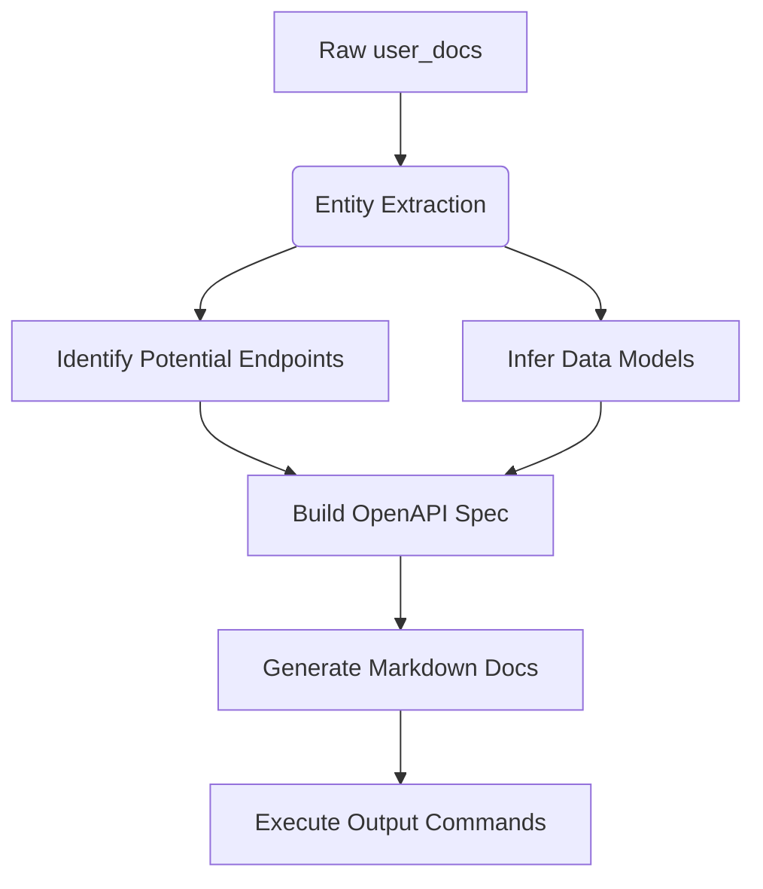

### Task: Intelligent Documentation Synthesis
**Objective:** Transform user-provided documentation (`%|user_docs|%`) into comprehensive technical specifications  
**Core Challenge:** Extrapolate API structure from potentially incomplete descriptions  
**Placeholder Syntax:** `%|variable|%` denotes replaceable content  (you must use placeholders for command param)

#### Processing Workflow:


#### Transformation Rules:
1. **Endpoint Inference**  
   - Detect action verbs: "create", "fetch", "update" → HTTP methods  
   - Identify resources: "user", "product" → URL paths  
   - Example:  
     "Add new contact" → `POST /contacts`  

2. **Model Generation**  
   - Extract mentioned fields: "name (string)", "price (number)"  
   - Create minimal schemas with inferred types  
   - Default required fields: `id` (string)  

3. **Response Handling**  
   - Always include `200` success response  
   - Add `400` error response by default  

#### Fallback Strategies:
| User Docs Element | OpenAPI Fallback | Markdown Fallback |
|-------------------|------------------|-------------------|
| No models | `GenericObject` schema | "Define models using key:type format" |
| No endpoints | `/ping` GET route | "Add endpoints: `VERB /path`" |
| No parameters | Empty requestBody | "Specify parameters in brackets" |

#### Minimal Commands Examples:
**OpenAPI** 
command: /openapi %|{
  "openapi": "3.0.0",
  "info": {"title": "User Management API", "version": "1.0"},
  "paths": {
    "/users": {
      "post": {
        "summary": "Create user",
        "responses": {"200": {"description": "User created"}}
      },
      "get": {
        "summary": "List users",
        "responses": {"200": {"description": "User list"}}
    }
  },
  "components": {
    "schemas": {
      "User": {
        "type": "object",
        "properties": {
          "id": {"type": "string"},
          "name": {"type": "string"}
        }
      }
    }
  }
}|%


**Markdown Docs Example**:
command: /docs %|# User Management API

## Models
**User**  
- id: string  
- name: string  

## Endpoints
**`POST /users`**  
Create new user  

**`GET /users`**  
Retrieve user list  
|%

#### Command Execution:
```
# Generate OpenAPI from inferred spec
/openapi %|constructed_openapi_json|%

# Create documentation from synthesized content
/docs %|generated_markdown|%

You also need to initialize everything you need using interfaces


```

#### Validation Requirements:
1. **OpenAPI MUST:**
   - Be valid JSON  
   - Contain at least 1 path and schema  

2. **Markdown MUST:**  
   - Include Models section  
   - Document at least 1 endpoint  

3. **Critical Enforcement:**  
   - Both output commands executed  
   - Text storage confirms completion  
   - Missing elements trigger warnings in docs  

``` 